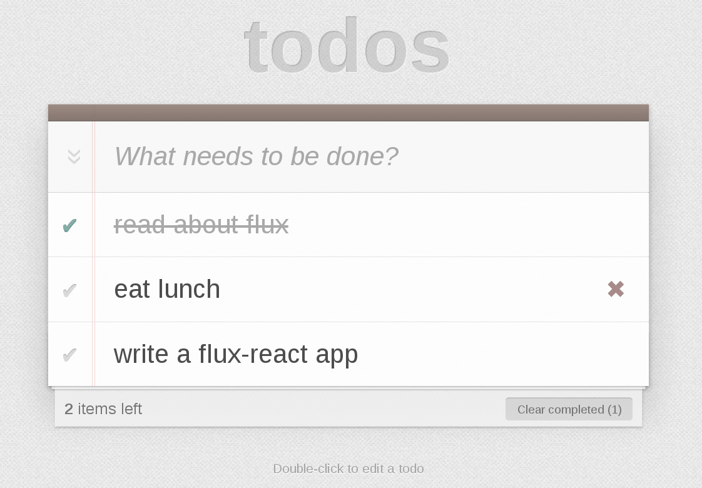

TodoMVC is [Flux](https://github.com/facebook/flux)'s [official example](https://github.com/facebook/flux/tree/master/examples/flux-todomvc), but still complicated for the beginners. This repo is its simplified version.



## How to Use

```bash
$ git clone git@github.com:ruanyf/flux-todomvc-demo.git
$ cd flux-todomvc-demo && npm install
$ npm start
```

Visit http://127.0.0.1:8080 with your browser.

## Learning Flux

First, you should read [Flux for stupid people](https://github.com/ruanyf/flux-for-stupid-people-demo) and its [demo](https://github.com/ruanyf/flux-for-stupid-people-demo).

Now, we want to build a [TodoMVC](http://todomvc.com/). How to do it?

### HTML Scaffold

`index.html` is used to load `bundle.js`.

```html
<!doctype html>
<html lang="en">
  <head>
    <meta charset="utf-8">
    <title>Flux • TodoMVC</title>
    <link rel="stylesheet" href="todomvc-common/base.css">
    <link rel="stylesheet" href="css/app.css">
  </head>
  <body>
    <section id="todoapp"></section>
    <footer id="info">
      <p>Double-click to edit a todo</p>
    </footer>
    <script src="js/bundle.js"></script>
  </body>
</html>
```

Our TodoMVC lives in the #todoapp section.

### App.js

`App.js` is the entry file.

```javascript
// js/app.js
var React = require('react');
var TodoApp = require('./components/TodoApp');

React.render(
  <TodoApp />,
  document.getElementById('todoapp')
);
```

You could find `TodoApp` is our top-level component.

### TodoApp

```javascript
// js/components/TodoApp.js
var React = require('react');

var Footer = require('./Footer');
var Header = require('./Header');
var MainSection = require('./MainSection');

var TodoApp = React.createClass({

  render: function() {
    return (
      <div>
        <Header />
        <MainSection data={this.state} />
        <Footer data={this.state} />
      </div>
    );
  },

});

module.exports = TodoApp;
```

You could find TodoApp is composed of 3 components of `Header`, `MainSection` and `Footer`.

## Header

```javascript
var React = require('react');
var TodoTextInput = require('./TodoTextInput');
var AppDispatcher = require('../dispatcher/AppDispatcher');

var Header = React.createClass({

  render: function() {
    return (
      <header id="header">
        <h1>todos</h1>
        <TodoTextInput
          id="new-todo"
          placeholder="What needs to be done?"
          onSave={this._onSave}
        />
      </header>
    );
  },

  _onSave: function(text) {
    if (text.trim()){
      AppDispatcher.dispatch({
        actionType: 'TODO_CREATE',
        text: text
      });
    }
  }

});

module.exports = Header;
```

The main part of `Header` is `TodoTextInput` used to input new Todo items.

### MainSection

`MainSection` shows a lot of `TodoItem`s.

```javascript
var React = require('react');
var TodoItem = require('./TodoItem');

var MainSection = React.createClass({

  render: function() {
    if (Object.keys(this.props.data).length < 1) {
      return null;
    }

    var allTodos = this.props.data;
    var todos = [];
    for (var key in allTodos) {
      todos.push(<TodoItem key={key} todo={allTodos[key]} />);
    }
    return (
      <section id="main">
        <input
          id="toggle-all"
          type="checkbox"
        />
        <label htmlFor="toggle-all">Mark all as complete</label>
        <ul id="todo-list">{todos}</ul>
      </section>
    );
  },
});

module.exports = MainSection;
```

### Footer

```javascript
var React = require('react');

var Footer = React.createClass({

  render: function() {

    return (
      <footer id="footer">
        <span id="todo-count">
          <strong>
            {itemsLeft}
          </strong>
          {itemsLeftPhrase}
        </span>
        {clearCompletedButton}
      </footer>
    );
  },

});

module.exports = Footer;
```

### Initial State

When TodoApp first loaded, its state is all existing TodoItems.

```javascript
// js/component/TodoApp.js

getInitialState: function() {
  return TodoStore.getAll();
},

render: function() {
  return (
    <div>
      <Header />
      <MainSection data={this.state} />
      <Footer data={this.state} />
    </div>
  );
},
```

### When user inputs something

User inputs a Todo item into `TodoTextInput`.

```javascript
// js/components/TodoTextInput.js
var React = require('react');

var ENTER_KEY_CODE = 13;

var TodoTextInput = React.createClass({

  getInitialState: function() {
    return {
      value: this.props.value || ''
    };
  },

  render: function() /*object*/ {
    return (
      <input
        className={this.props.className}
        id={this.props.id}
        placeholder={this.props.placeholder}
        onBlur={this._save}
        onChange={this._onChange}
        onKeyDown={this._onKeyDown}
        value={this.state.value}
        autoFocus={true}
      />
    );
  },

  _save: function() {
    this.props.onSave(this.state.value);
    this.setState({
      value: ''
    });
  },

  _onChange: function(/*object*/ event) {
    this.setState({
      value: event.target.value
    });
  },

  _onKeyDown: function(event) {
    if (event.keyCode === ENTER_KEY_CODE) {
      this._save();
    }
  }

});

module.exports = TodoTextInput;
```

When `TodoTextInput` loses the focus, or user presses down the Enter key, `this.props.onSave(this.state.value)` will be called.

```javascript
// js/components/Header.js
  _onSave: function(text) {
    if (text.trim()){
      AppDispatcher.dispatch({
        actionType: 'TODO_CREATE',
        text: text
      });
    }
  }
```

`_onSave` uses `AppDispatcher.dispatch` to send an action `TODO_CREATE`.

```javascript
// js/dispatcher/AppDispatcher.js

var Dispatcher = require('flux').Dispatcher;
var AppDispatcher = new Dispatcher();
var TodoStore = require('../stores/TodoStore');

AppDispatcher.register(function(action) {
  var text;

  switch(action.actionType) {
    case 'TODO_CREATE':
      text = action.text.trim();
      if (text !== '') {
        TodoStore.create(text);
        TodoStore.emit('change');
      }
      break;

    default:
      // no op
  }
});

module.exports = AppDispatcher;
```

`AppDispatcher` creates a item in `TodoStore`. Then, `TodoStore` emits a `change` event.

`TodoApp` listens the `change` event.

```javascript
// js/components/TodoApp.js

  componentDidMount: function() {
    TodoStore.on('change', this._onChange);
  },

  componentWillUnmount: function() {
    TodoStore.removeListener('change', this._onChange);
  },
```

`this._onChange` is the callback of `change` event.

```javascript
  _onChange: function() {
    this.state = TodoStore.getAll();
    this.forceUpdate();
    // this.setState(TodoStore.getAll());
  }
```

`TodoApp` gets all Todo items in the store, and puts them into `TodoApp` state object. Then, make a forced re-rendering of TodoApp.

Now we can see the new Todo items in the browser.

## License

MIT
